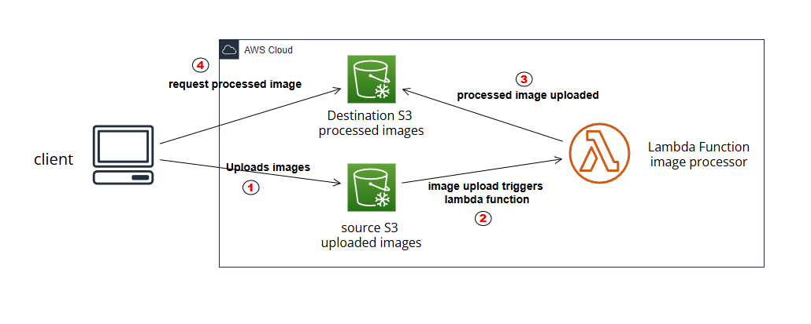

# Serverless Image Processing with AWS Lambda & S3

This project demonstrates a fully serverless application that processes images uploaded by users. When an image is uploaded to an S3 bucket, a Lambda function is triggered to resize the image and store it in a separate output bucket.

---

##  Architecture Diagram



---

##  Architecture Components

| AWS Service         | Purpose                                       |
|---------------------|-----------------------------------------------|
| Amazon S3           | Stores original and processed images          |
| AWS Lambda          | Handles image processing (resize)             |
| IAM Roles           | Grants Lambda permissions to access S3        |
| Amazon CloudWatch   | Logs and metrics for Lambda execution         |

---

##  How It Works

1. A user uploads an image (e.g., `.jpg`) to the **source S3 bucket**
2. The **S3 event** triggers the **Lambda function**
3. Lambda resizes the image using Python (Pillow library)
4. The resized image is stored in the **destination S3 bucket**

---

##  Deployment Instructions

### 1. Prerequisites

- AWS account
- IAM user with permissions to manage S3 and Lambda
- AWS CLI or AWS Console

### 2. Create S3 Buckets

```bash
aws s3 mb s3://my-upload-bucket
aws s3 mb s3://my-processed-bucket
```
### 3. Create the Lambda Function
Runtime: Python 3.9+

Use index.py file inside lambda/ folder

Add this environment variable:
| Key        | Value                                       |
|---------------------|-----------------------------------------------|
| DEST_BUCKET          | my-processed-bucket          |

### 4. Attach IAM Policy to Lambda Role
```json
{
  "Version": "2012-10-17",
  "Statement": [
    {
      "Effect": "Allow",
      "Action": [
        "s3:GetObject",
        "s3:PutObject"
      ],
      "Resource": [
        "arn:aws:s3:::my-upload-bucket/*",
        "arn:aws:s3:::my-processed-bucket/*"
      ]
    }
  ]
}
```
### 5. Add S3 Trigger to Lambda
- Choose my-upload-bucket
- Event type: ObjectCreated (All)
- Prefix (optional): images/


---
## Testing

1. Upload an image (e.g., photo.jpg) to the upload bucket
2. Check the processed bucket for a resized version (300x300 px)

---
## Security Best Practices

- Apply least-privilege IAM roles
- Block public access on both S3 buckets
- Enable bucket versioning and encryption
---
## Cost Considerations

1. AWS Lambda: pay-per-execution and duration
2. S3: standard storage rates
3. CloudWatch: minimal logs unless heavily used
---
## Learning Outcomes

- Serverless architecture design
- S3 event triggers
- Lambda with environment variables
- Secure IAM configurations
- Cloud-native automation workflows
---
## Optional Enhancements

- Add API Gateway for uploading images via POST request
- Store metadata (filename, size) in DynamoDB
- Use Step Functions for multiple processing steps
----
